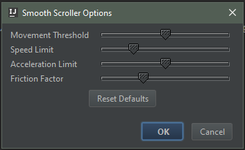

# Smooth and intertial scrolling for IntelliJ based IDE's

IntelliJ plugin that provides smooth scrolling. It also provides acceleration effects
with easing so you can "fling" like on a cell phone.

I have tested it with touchpads and mouse wheels on IntelliJ Community
and Android Studio. Hopefully, it will work on any IntelliJ product.

There are several options available under Tools -> Smooth Scroller Options...

Between these and the touchpad/mouse settings on your hardware, you should be able to get good performance.

You can find the plugin here.

Inspired by: [smooth-scroll-plugin](https://github.com/hccampos/smooth-scroll-plugin)
Thanks Hugo!